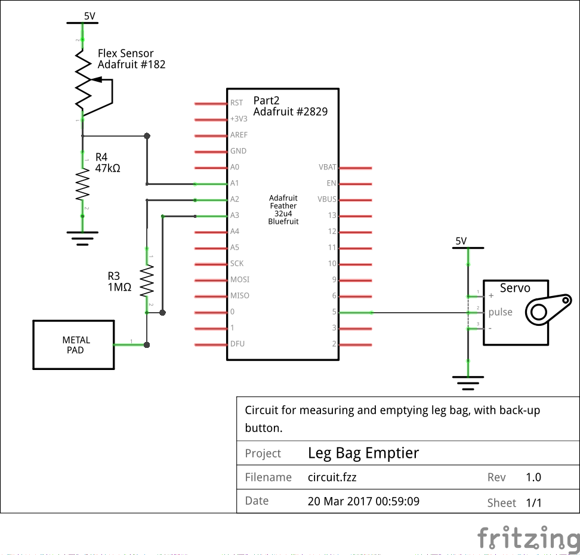
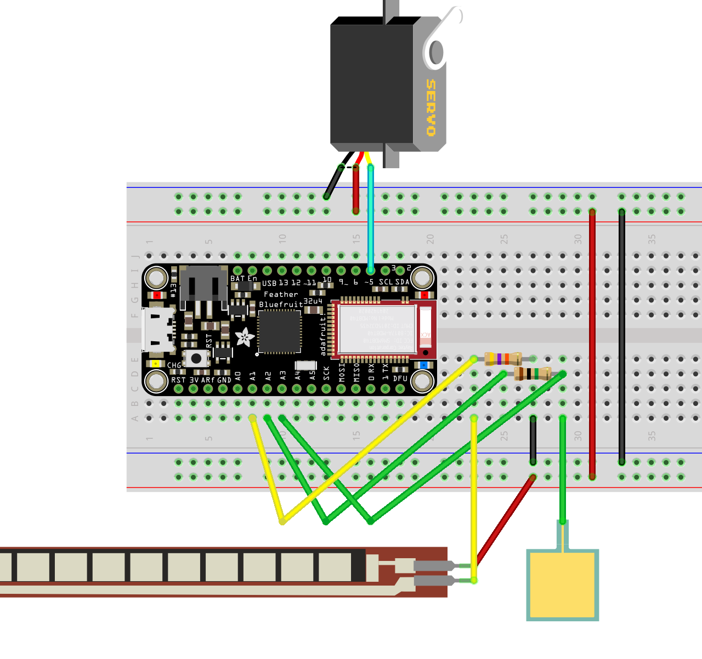

The TOMBerkeley Leg Bag
=======================

This is a smartphone-controlled (via Bluetooth) device for emptying a leg bag
and monitoring how full said leg bag is.

Files
=====

 * `arduino`:                Contains the Arduino code for the project
 * `com.tomberkeley.legbag`: Contains a Cordova project

Diagrams
========

Debugging
============

On Android with Google Chrome you can debug the app by enabling **Developer
Mode** on the phone and then enabling **USB Debugging**. You can then go to
[chrome://inspect](chrome://inspect) to see what's happening on the app.

Contributors
============
 * Ali Nazari
 * Richard Barnes (rijard.barnes@gmail.com, http://rbarnes.org, Github: r-barnes)
 * Jorge Ruiz
 * Katherine Lau
 * Nupur Kaku
 * Rafe Biggs
 * Viola Quach